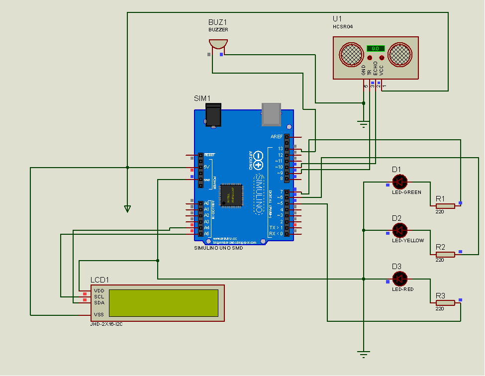
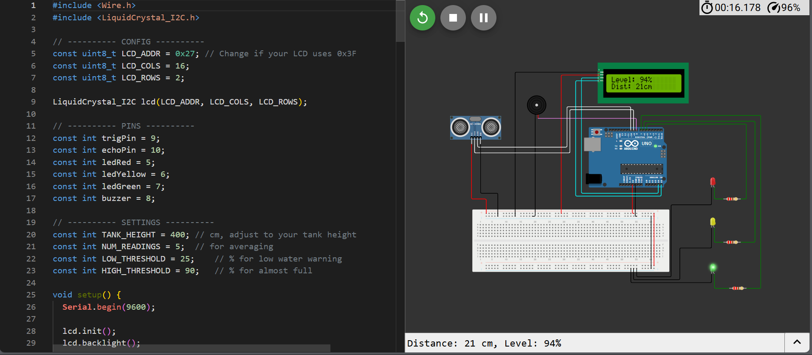

# Water Level Indicator (Arduino)

## 📌 Overview
This project is an Arduino-based **Water Level Indicator** designed to monitor the level of water in a tank or container and provide visual alerts using LEDs. It is a simple, practical embedded systems project that demonstrates sensor interfacing, real-time monitoring, and output control.

This project is suitable for beginners learning Arduino, electronics, and hardware–software integration.

---

## 🖼️ Project Preview
> Images of the circuit setup and working prototype are included below.




---

## 🎯 Objectives
- Detect water levels using a sensor  
- Provide visual indication of water level status  
- Practice Arduino programming and circuit design  
- Understand real-time sensor data processing  

---

## 🛠️ Components Used
| Component | Quantity |
|---------|----------|
| Arduino Uno | 1 |
| Water Level Sensor | 1 |
| LEDs (Red, Yellow, Green) | 3 |
| Buzzer | 1 |
| LCD | 1
| Resistors | 3 |
| Breadboard | 1 |
| Jumper Wires | As needed |
| Emotional Support | A little |

---

## ⚙️ How It Works
1. The water level sensor detects the presence of water at different heights  
2. Sensor readings are sent to the Arduino  
3. Based on the water level:
   - **Low level** → Red LED turns ON  
   - **Medium level** → Yellow LED turns ON  
   - **High level** → Green LED turns ON  
4. The system updates in real time as the water level changes  

---

## 📂 Project Structure
```
water-level-indicator/
│
├── images/
│   ├── circuit.jpg
│   └── prototype.jpg
│
├── arduino.c
│
└── README.md
```

---

## 🚀 Getting Started
1. Connect the components according to the circuit diagram  
2. Open the Arduino IDE  
3. Upload the `arduino.c` file save as `project.ino`
4. Power the Arduino board  
5. Place the sensor in water and observe the LED indicators  

---

## 📖 Learning Outcomes
- Understanding of sensor interfacing  
- Experience with conditional logic in Arduino  
- Practical knowledge of embedded systems  
- Improved debugging and testing skills  

---

## 📌 Applications
- Water tank monitoring  
- Overflow prevention systems  
- Embedded systems learning projects  
- Academic mini projects  

---

## 📄 License
This project is open-source and available under the MIT License.
